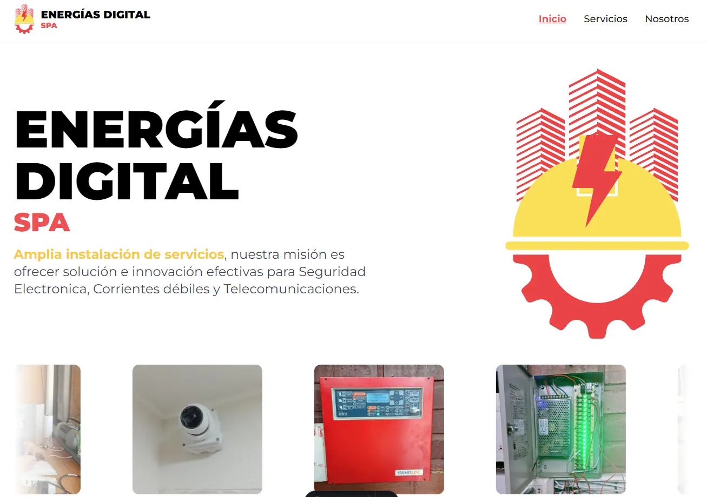

# Energías Digital SPA

Este repositorio contiene el código fuente del sitio web oficial de Energías Digital SPA. La página está desarrollada con [Astro](https://astro.build/) y utiliza [Tailwind CSS](https://tailwindcss.com/) para el diseño y estilos.

## ✨ Descripción del Proyecto

Energías Digital SPA es una empresa dedicada a la instalación de servicios de Seguridad Electrónica, Corrientes Débiles y Telecomunicaciones. Este sitio web tiene como objetivo presentar los servicios ofrecidos por la empresa, así como facilitar el contacto con los clientes mediante un botón de WhatsApp y herramientas de analíticas como Google Analytics y Meta Ads.

## 🚀 Estructura del Proyecto

La estructura principal del proyecto es la siguiente:

```text
/
├── public/
│   └── favicon.svg
├── src/
│   ├── components/
│   │   ├── icons/
│   │   ├── Button_Whatsapp.astro
│   │   ├── Card_Projects.astro
│   │   ├── Card_Services.astro
│   │   ├── Carousel_Projects.astro
│   │   ├── Carousel.astro
│   │   ├── Footer.astro
│   │   ├── Navbar.astro
│   │   ├── Presentation.astro
│   │   └── Value_Proposition.astro
│   ├── layouts/
│   │   └── Layout.astro
│   └── pages/
│       ├── 404.astro
│       ├── about_us.astro
│       ├── index.astro
│       ├── privacy_policies.astro
│       ├── services.astro
│       └── terms_and_conditions.astro
├── astro.config.mjs
├── tailwind.config.mjs
└── package.json
```

## 🔧 Tecnologías Utilizadas

- **[Astro](https://astro.build/):** Framework web para construir sitios rápidos y modernos.
- **[Tailwind CSS](https://tailwindcss.com/):** Librería de utilidades para diseño y estilos.
- **Google Analytics y Meta Ads:** Implementación de analíticas y herramientas publicitarias.

## 🔄 Comandos Disponibles

Ejecuta los siguientes comandos desde la raíz del proyecto:

| Comando                   | Acción                                                |
| :------------------------ | :---------------------------------------------------- |
| `npm install`             | Instala las dependencias                              |
| `npm run dev`             | Inicia el servidor local en `localhost:4321`          |
| `npm run build`           | Construye el sitio para producción en `./dist/`       |
| `npm run preview`         | Previsualiza la versión construida localmente         |
| `npm run astro ...`       | Ejecuta comandos CLI como `astro add` o `astro check` |
| `npm run astro -- --help` | Muestra ayuda para el CLI de Astro                    |

## ☁️ Despliegue

El sitio puede ser desplegado en cualquier plataforma que soporte archivos estáticos, como [Netlify](https://www.netlify.com/) o [Vercel](https://vercel.com/).

## 🔍 Vista Previa


